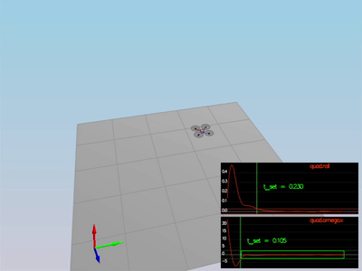

# Control of a 3D Quadrotor Drone


## Scenario 1

- Goal: Keep at the same position, and not fall down to the ground

<p align="center">

</p>

```
PASS: ABS(Quad.PosFollowErr) was less than 0.500000 for at least 0.800000 seconds
```

## Scenario 2 

- Goal: Stop vehicle's rolling by 
    - controlling the veichle's rotation (omega.x) to be 0
    - controlling the vehicle's angle (roll) to be 0 

    

<p align="center">

</p>

```
PASS: ABS(Quad.Roll) was less than 0.025000 for at least 0.750000 seconds
PASS: ABS(Quad.Omega.X) was less than 2.500000 for at least 0.750000 seconds
```

## Scenario 3

<p align="center">

</p>

```
PASS: ABS(Quad1.Pos.X) was less than 0.100000 for at least 1.250000 seconds
PASS: ABS(Quad2.Pos.X) was less than 0.100000 for at least 1.250000 seconds
PASS: ABS(Quad2.Yaw) was less than 0.100000 for at least 1.000000 seconds
```

## Scenario 4


<p align="center">

</p>

```
PASS: ABS(Quad1.PosFollowErr) was less than 0.100000 for at least 1.500000 seconds
PASS: ABS(Quad2.PosFollowErr) was less than 0.100000 for at least 1.500000 seconds
PASS: ABS(Quad3.PosFollowErr) was less than 0.100000 for at least 1.500000 seconds
```

## Scenario 5


<p align="center">

</p>

```
PASS: ABS(Quad2.PosFollowErr) was less than 0.250000 for at least 3.000000 seconds
```


